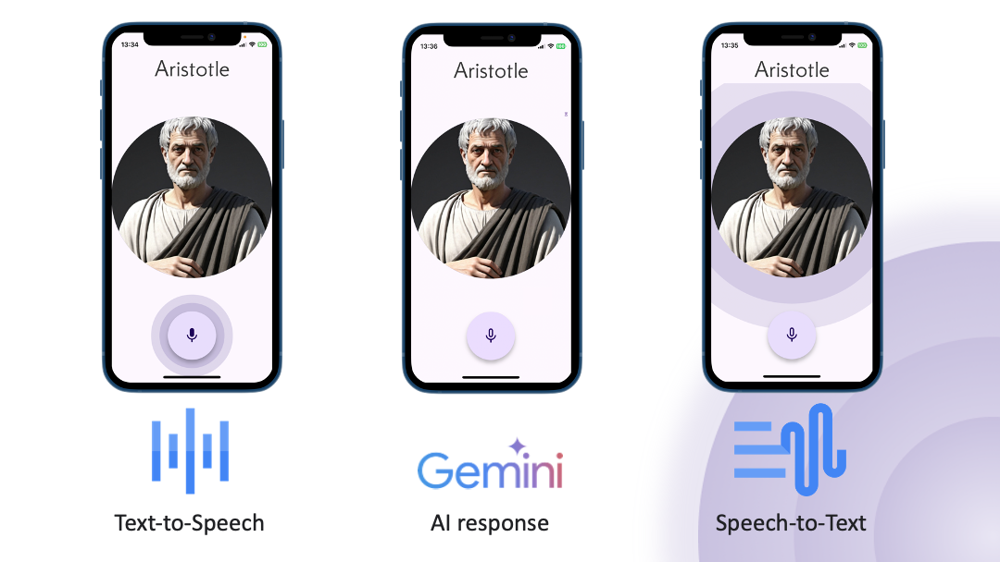

# Echoes

## Note
This project created for Gemini API Developer Competition: https://ai.google.dev/competition
This is just a Demo app, so don't use this code in production! You should never store API tokens insiude the app.

## About the app
This application allows you to talk to the greatest minds of past utilizing Gemini API and GCP capabilities. Demo version contains only one character - Aristotle.

## Getting Started
The app is built on top of the crossplatform Flutter framework with the focus on the Mobile platforms. I cheched the app on Android, iPhone and iPad and it works properly.

### Build preconditions
Application utilizes Gemini API and GCP Synthesize API, so credentials should be provided under the following file:
[constants.dart](./lib/constants.dart)

### Gemini API key:
Go to google AI Studio and generate a key here: https://aistudio.google.com/app/apikey
Then paste it as a value of `geminiApiKey` constant in [constants.dart](./lib/constants.dart)

### Google Gloud integration:
In order to use Synthesize API we need to have google cloud project with enabled API. Follow the steps below:

1. Create new GCP project (https://cloud.google.com/resource-manager/docs/creating-managing-projects)
2. Paste the Project ID as a value of `gooogleCloudProjectId` in [constants.dart](./lib/constants.dart)
3. Activate billing account **Please note that some API calls may be a subject to charge** (https://cloud.google.com/billing/docs/how-to/modify-project)
4. Enable Cloud Text-to-Speech API and Generative Language API for your project (https://console.cloud.google.com/apis/dashboard) More derails (https://cloud.google.com/endpoints/docs/openapi/enable-api)
5. Now you can create a google cloud access token. I recommend opening a Cloud Shell and using the folollowing command: `gcloud auth print-access-token`. Cloud shell can as you to authorize of select the project.
6. After getting the token paste it as a value for `googleCloudAccessToken` in [constants.dart](./lib/constants.dart) Please note that access token lifetime is short enough, so you will need to generate new token and paste it to the constants every time when the old one is expired.

### Flutter build
Now you are good to go and can build and run flutter project on your mobile device using
`flutter run` command.

New to flutter? - I recomment the following course: https://developers.google.com/learn/pathways/intro-to-flutter

## Apache License, Version 2.0

Copyright [2024] [Artem Bagritsevich]

Licensed under the Apache License, Version 2.0 (the "License");
you may not use this file except in compliance with the License.
You may obtain a copy of the License at

    http://www.apache.org/licenses/LICENSE-2.0

Unless required by applicable law or agreed to in writing, software
distributed under the License is distributed on an "AS IS" BASIS,
WITHOUT WARRANTIES OR CONDITIONS OF ANY KIND, either express or implied.
See the License for the specific language governing permissions and
limitations under the License.
